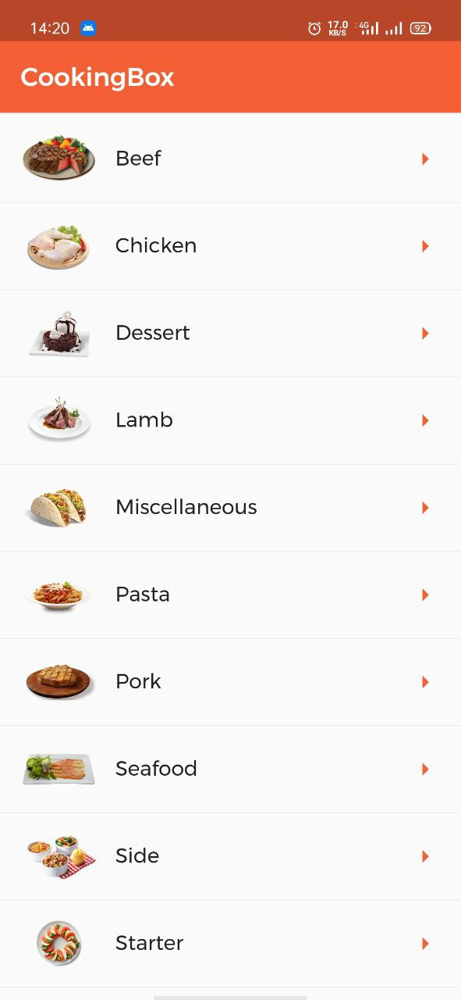
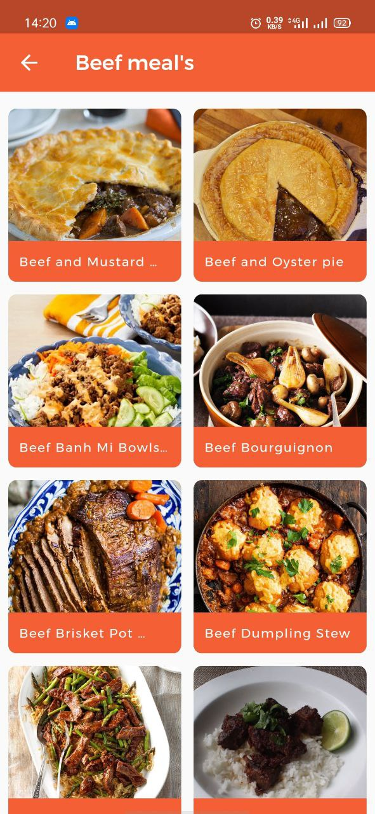

# CookingBox app
CookingBox an meals recipes app build with [Flutter](https://flutter.dev/)

## Features
- Show meal categories
- Show meals by category
- HTTP and image caching
- Data from [TheMealDB API](https://www.themealdb.com/api.php)
## Screenshots

  
  

